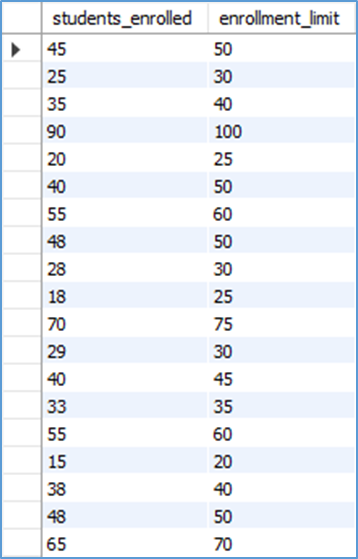

# Finals Task 3.1 - Using MYSQL Clause
In this activity, we created a database named `online_courseDB` using MySQL. The tasks involved creating and using the `online_course` table to perform various SELECT queries. These
queries included filtering courses by enrollment limits, grouping and counting enrollments by category, retrieving courses by category and student count, and sorting results based on enrollment numbers. The final outputs included SQL query statements, query results, and a SQL copy of the database structure.

## Creating Database:

## Creating Courses Table:

## Inserting in Courses Table:

## Task 1: 
- Query Statement
  

- Table Structure
  

## Task 2: 
- Query Statement

- Table Structure

## Task 3: 
- Query Statement

- Table Structure

## Task 4: 
- Query Statement

- Table Structure

## Task 5:
- Query Statement

- Table Structure

